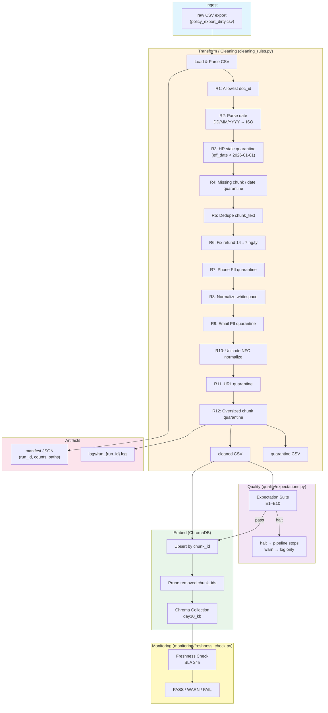

# Kiến trúc pipeline — Lab Day 10: Data Pipeline & Data Observability

**Nhóm:** E402-Group06
**Cập nhật:** 2026-04-15

---

## 1. Sơ đồ luồng (Mermaid)

**Điểm đo Freshness:** measured tại boundary `publish` (sau khi embed hoàn tất), đọc `latest_exported_at` từ manifest.
**Ghi run_id:** mỗi run tạo `artifacts/manifests/manifest_{run_id}.json` chứa UUID/timestamp.
**Quarantine:** record bị reject ghi vào `artifacts/quarantine/quarantine_{run_id}.csv` với lý do.

---

## 2. Ranh giới trách nhiệm

| Thành phần | Input | Output | Owner nhóm |
|------------|-------|--------|------------|
| Ingest | `data/raw/policy_export_dirty.csv` | List[Dict] raw rows | Ingestion Owner |
| Transform | Raw rows | `(cleaned, quarantine)` tuples | Cleaning & Quality Owner |
| Quality | Cleaned rows | `ExpectationResult[]` + halt flag | Cleaning & Quality Owner |
| Embed | `cleaned CSV` | Chroma `day10_kb` collection (upsert + prune) | Embed & Idempotency Owner |
| Monitor | Manifest JSON | PASS/WARN/FAIL freshness | Monitoring / Docs Owner |

---

## 3. Idempotency & rerun

- **Upsert strategy:** mỗi `chunk_id` được upsert vào Chroma — chạy lại với cùng cleaned CSV → vector giữ nguyên (idempotent).
- **Prune:** sau mỗi run, xóa các `chunk_id` không còn trong cleaned CSV (tránh vector stale từ record đã quarantine/dedupe).
- **Verified:** chạy `ci-smoke` và `ci-smoke2` tạo cùng `cleaned_ci-smoke.csv` → manifest khớp hoàn toàn.

**Rerun 2 lần không duplicate vector.**

---

## 4. Liên hệ Day 09

Pipeline này cung cấp corpus đã clean & embed vào Chroma collection `day10_kb` (tách khỏi Day 09 `day09_kb`).

- **Day 09** multi-agent query vào `day09_kb` để trả lời hỏi đa nguồn.
- **Day 10** pipeline là lớp data observability trước khi agent "đọc đúng version" policy.
- Hai collection dùng **cùng embedding model** (`all-MiniLM-L6-v2`) nhưng cách ly để dễ debug.

---

## 5. Rủi ro đã biết

- HR policy có 2 version (10 ngày / 12 ngày) → quarantine bản cũ là chìa khóa chất lượng.
- Refund policy có stale chunk từ migration v3 → fix 14→7 ngày.
- Nếu raw export chứa PII (phone/email) → bị quarantine tự động (R7/R9).
- Freshness SLA mặc định 24h — cần alert channel (Slack/email) khi FAIL.
- Data contract owner chưa được gán người thực tế → cần cập nhật trước khi production.
